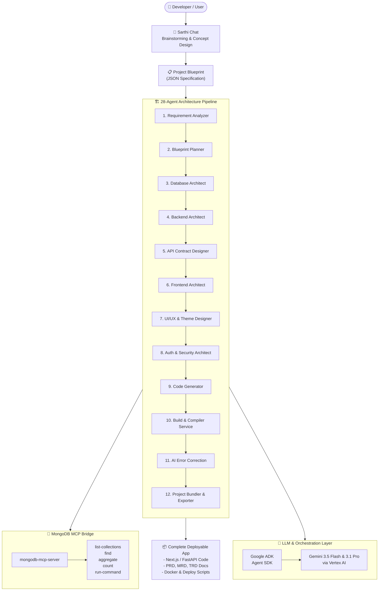

# 🛡️ Sarthi — AI-Powered Project Charioteer

An enterprise-grade, action-oriented multi-agent workspace that transforms raw product ideas into fully-documented, compiled, and deployable software repositories.

<div align="center">

[](https://deepmind.google/technologies/gemini/)
[](https://google.github.io/adk-docs/)
[](https://github.com/mongodb-js/mongodb-mcp-server)
[](LICENSE)

**[🌐 Live Web Workspace](https://sarthi-gtu3eysx6q-uc.a.run.app) · [🏛️ System Architecture](#-system-architecture) · [🛠️ Local Setup Guide](#-quick-start) · [🔌 MCP Verification](#-mongodb-mcp-verification)**

</div>

---

## 🌟 What is Sarthi?

Inspired by the concept of a **Sarthi** (a divine guide and charioteer), this platform is **not another generic AI wrapper or simple chatbot**. It is a **fully-realized software engineering workspace** powered by Google Cloud Vertex AI, Google Agent Development Kit (ADK), and MongoDB MCP.

Instead of writing code snippet-by-snippet, you brainstorm your product idea interactively. Once finalized, Sarthi orchestrates a **hierarchical pipeline of specialized AI agents** that work in parallel and sequence to architect, generate, test, repair, compile, and bundle your application.

```
       [ Raw Product Idea ]
                │
                ▼
      ┌──────────────────┐
      │  Sarthi Chat &   │  ◄─── Brainstorm & refine with the "Charioteer"
      │  Requirements    │
      └─────────┬────────┘
                │
                ▼
      ┌──────────────────┐
      │  28-Agent Vyuh   │  ◄─── Parallel/Sequential specialized agents
      │  Assembly Line   │       (Database, API, Security, Frontend, UI/UX)
      └─────────┬────────┘
                │
                ▼
      ┌──────────────────┐
      │  Live Compiler   │  ◄─── Codebase generation & real-time self-repair
      │  & Code Console  │
      └─────────┬────────┘
                │
                ▼
      [ 📦 Complete Downloadable Repository ]
      - FastAPI Backend & Next.js Frontend
      - MongoDB Schemas & JWT Security Guards
      - Docker Compose & Cloud Deploy Scripts
```

---

## 🚀 Live Environment

*   **Production Web Workspace**: [https://sarthi-gtu3eysx6q-uc.a.run.app](https://sarthi-gtu3eysx6q-uc.a.run.app)

---

## ✨ Key Features & Capabilities

*   🧠 **Interactive Co-Founder Mode**: Refines user ideas into functional specifications, proposing database collections, UX colors, and custom routes.
*   🏗️ **Specialized Agent Assembly**: Pipeline agents design individual layers—from MongoDB database schemas and API contracts to security guards and Docker configs.
*   🔌 **MongoDB Model Context Protocol (MCP)**: Interfaces directly with the official `mongodb-mcp-server` to automatically inspect collections, run queries, and optimize schemas.
*   ⚡ **Google Cloud Vertex AI (IAM-based)**: Fully migrated to Vertex AI for enterprise reliability, authenticating automatically via Service Account Application Default Credentials (ADC) without cleartext API keys.
*   🔄 **Live Code Console & Vyuh Map**: Stream real-time progress, read terminal-style execution logs, play workspace audio cues (`sarthiAudio`), and view module dependencies dynamically.

---

## 🏛️ System Architecture



---

## 🛠️ Tech Stack

| Layer | Technologies |
|---|---|
| **Frontend** | Next.js 16 (Turbopack), React 19, Tailwind CSS, Framer Motion, Web Audio API |
| **Backend** | FastAPI, Uvicorn, Python 3.11+, Motor (async MongoDB driver) |
| **Orchestration** | Google Agent Development Kit (ADK), LangGraph |
| **Models** | `gemini-2.5-flash` (Fast tasks/Chat), `gemini-3.1-pro` (Reasoning & Code Compilation) |
| **Database** | MongoDB Atlas |
| **MCP** | `mongodb-mcp-server@latest` (Stdio bridge) |

---

## ⚡ Quick Start

### Prerequisites
- Python 3.11+
- Node.js 20+
- MongoDB instance (local or Atlas)
- Google Cloud SDK (`gcloud` CLI)

### 1. Local Credentials Authentication (Vertex AI)
To run Sarthi locally without exposing cleartext API keys, authenticate your local terminal with GCP Application Default Credentials:
```bash
gcloud auth application-default login
```

### 2. Backend Setup
```bash
cd backend
python -m venv venv
venv\Scripts\activate  # On Windows
# source venv/bin/activate  # On macOS/Linux

pip install -r requirements.txt
cp .env.example .env  # Configure your settings (no API keys required!)
uvicorn app.main:app --reload
```

### 3. Frontend Setup
```bash
cd frontend
npm install
npm run dev
```
Open **[http://localhost:3000](http://localhost:3000)** to launch your local workspace.

---

## 🔌 MongoDB MCP Verification

Sarthi exposes system integration endpoints to verify live MongoDB MCP operations:

*   **System Health & MCP Status**: `GET /api/health`
*   **MCP Connection Details**: `GET /api/mcp/status`
*   **Available MCP Tools**: `GET /api/mcp/tools`
*   **MCP Proof Evidence Bundle**: `GET /api/mcp/evidence`

### Verification via Local Terminal
Once your backend is running locally:
```bash
# Check system health & MongoDB connection
curl http://localhost:8000/api/health

# Fetch MCP judging evidence
curl http://localhost:8000/api/mcp/evidence
```

---

## 📂 Repository Structure

```
Sarthi/
├── backend/
│   ├── app/
│   │   ├── agents/          # 28 specialized pipeline agents
│   │   ├── api/             # FastAPI routers (auth, chats, projects, mcp)
│   │   ├── core/            # Configs (Vertex AI & global settings)
│   │   ├── db/              # MongoDB & Redis adapters
│   │   └── services/        # ADK agent wrappers, LLM router, MCP bridge
│   ├── Dockerfile
│   └── requirements.txt
├── frontend/
│   ├── src/
│   │   ├── app/             # Next.js app routes
│   │   ├── components/      # UI components (chat, console, viewer)
│   │   └── context/         # React Context state
│   ├── Dockerfile
│   └── package.json
├── docker-compose.yml
├── deploy.ps1               # PowerShell Deployment Script
└── README.md
```

---

## 📄 License
This project is licensed under the MIT License - see the [LICENSE](LICENSE) file for details.

---

<div align="center">
Built with ❤️ for the <b>Building Agents for Real-World Challenges</b> Hackathon — MongoDB Partner Track
</div>
