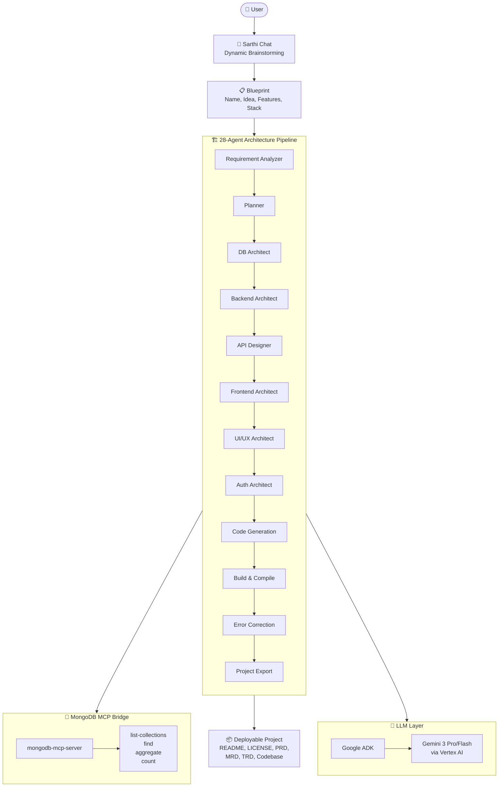

<](https://deepmind.google/technologies/gemini/)
[](https://github.com/mongodb-js/mongodb-mcp-server)
[](https://google.github.io/adk-docs/)
[](LICENSE)
[](#hackathon-track)

---

**[Getting Started](#quick-start-local-development) · [Architecture](#architecture) · [Tech Stack](#tech-stack) · [MCP Verification](#mongodb-mcp-verification) · [Deploy](#deployment)**

</div>

---

## 🤔 What is Sarthi?

**Sarthi is not a chatbot — it's an AI agent system.**

It takes a vague project idea and runs it through a **multi-agent pipeline of 28 specialized AI agents** to produce a **complete, deployable codebase** with full documentation.

> 💡 Think of it as an AI tech co-founder: you describe the idea, Sarthi architects the entire project — database schemas, API contracts, authentication flows, frontend layouts, DevOps configs, and production-ready code.

---

## ✨ Key Features

| | Feature | Description |
|---|---|---|
| 🧠 | **Dynamic AI Chat** | Brainstorm with Sarthi like a tech co-founder. It suggests features, discusses trade-offs, and generates structured blueprints. |
| 🏗️ | **28-Agent Architecture Pipeline** | Requirement Analyzer → Planner → DB Architect → Backend Architect → API Designer → Frontend Architect → UI/UX → Auth → DevOps → Security → Testing → Validation → Code Generation → Build → Error Correction → Export |
| 🔌 | **MongoDB MCP Integration** | Uses the official MongoDB MCP server (`mongodb-mcp-server@latest`) to give agents real-time database context for schema design and query optimization. |
| 📦 | **Complete Project Export** | Generates Flask/Next.js codebase with README, LICENSE, PRD/MRD/TRD docs, and Devpost artifacts — ready to submit or deploy. |
| ⚡ | **Google ADK + Vertex AI** | Powered by Google's Agent Development Kit with Gemini 3 Pro/Flash models via Vertex AI for enterprise-grade reliability. |
| 🔄 | **Real-time Progress** | WebSocket-driven live updates as each agent completes its phase, so you can watch the architecture unfold in real time. |

---

## 🏛️ Architecture



---

## 🏆 Hackathon Track

| | Detail |
|---|---|
| **Hackathon** | Building Agents for Real-World Challenges |
| **Partner Track** | MongoDB |
| **MCP Server** | `mongodb-mcp-server@latest` |
| **Model** | Gemini 3 Pro / Flash via Google Vertex AI |
| **Framework** | Google Agent Development Kit (ADK) |

---

## 🛠️ Tech Stack

| Layer | Technology |
|---|---|
| **Frontend** | Next.js 16, React 19, Tailwind CSS, Framer Motion |
| **Backend** | FastAPI, Python 3.11+, Uvicorn |
| **AI / LLM** | Google ADK, Gemini 3 Pro/Flash, LangGraph |
| **Database** | MongoDB Atlas (via Motor async driver) |
| **MCP** | MongoDB MCP Server (stdio protocol) |
| **Real-time** | WebSockets |
| **Auth** | JWT + bcrypt |

---

## 🚀 Quick Start (Local Development)

### Prerequisites

- Python 3.11+
- Node.js 18+
- MongoDB (local or Atlas)
- Google Cloud API key or Vertex AI credentials

### Backend

```bash
cd backend
python -m venv .venv
.venv\Scripts\activate  # Windows
pip install -r requirements.txt
cp ../.env.example .env  # Configure your keys
uvicorn app.main:app --reload --port 8000
```

### Frontend

```bash
cd frontend
npm install
npm run dev
```

Open **[http://localhost:3000](http://localhost:3000)** and start building.

---

## 🐳 Deployment

### Docker Compose

```bash
docker-compose up --build
```

### Google Cloud Run

```bash
chmod +x deploy.sh
./deploy.sh
```

---

## ✅ MongoDB MCP Verification

> **For Judges:** These endpoints provide direct proof of MongoDB MCP integration.

| Endpoint | Method | Description |
|---|---|---|
| `/api/health` | `GET` | System health + MCP status |
| `/api/mcp/status` | `GET` | MCP bridge mode and connection details |
| `/api/mcp/tools` | `GET` | Available MCP tools |
| `/api/mcp/evidence` | `GET` | Compact proof bundle for judging |
| `/api/mcp/execute` | `POST` | Execute an MCP tool manually |

```bash
# Quick verification
curl http://localhost:8000/api/health
curl http://localhost:8000/api/mcp/evidence
```

---

## 📂 Project Structure

```
Sarthi/
├── backend/
│   ├── app/
│   │   ├── agents/          # 28 specialized AI agents
│   │   ├── api/             # FastAPI routes (auth, chats, projects, mcp)
│   │   ├── core/            # Configuration
│   │   ├── db/              # MongoDB & Redis connections
│   │   ├── models/          # Pydantic models
│   │   └── services/        # ADK agent, LLM router, MCP manager, AI
│   ├── Dockerfile
│   └── requirements.txt
├── frontend/
│   ├── src/
│   │   ├── app/             # Next.js pages
│   │   ├── components/      # React components
│   │   └── context/         # State management
│   ├── Dockerfile
│   └── package.json
├── docker-compose.yml
├── deploy.sh               # Cloud Run deployment script
├── LICENSE                  # MIT
└── README.md
```

---

## 📄 License

MIT — see [LICENSE](LICENSE) for details.

---

<div align="center">

**Built with ❤️ for the _Building Agents for Real-World Challenges_ Hackathon — MongoDB Partner Track**

[](https://deepmind.google/technologies/gemini/)
[](https://www.mongodb.com/)
[](https://cloud.google.com/)

</div>
]]>
